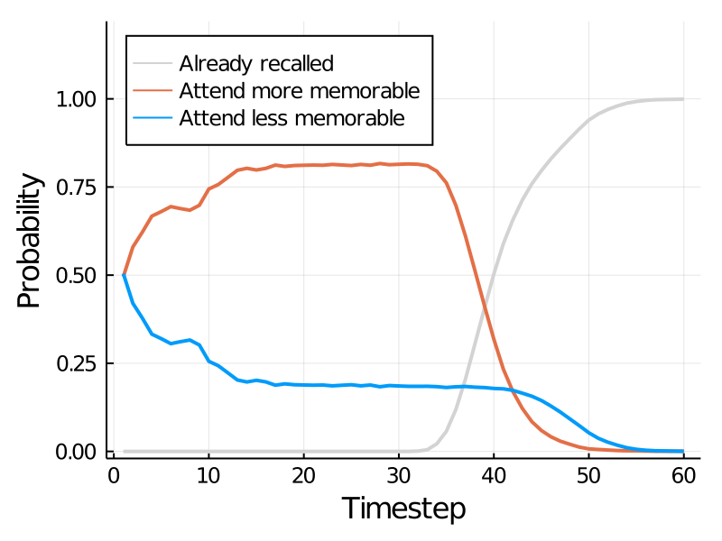

# Summary

Memory recall is often modeled as a process of evidence accumulation. Existing
models typically assume that this accumulation process is passive, and not
subject to top-down control. In contrast, recent work in perceptual and
value-based decision making has suggested that similar kinds of evidence
accumulation processes are guided by attention, such that evidence for
attended items is accumulated faster than for non-attended items. Furthermore,
attention may be adaptively allocated to different items in order to optimize
a tradeoff between decision quality and the computational cost of evidence
accumulation. In this project, we ask whether similar forces are at play in
the context of memory recall.

Such a model predicts that, when multiple memories are relevant, people will
focus their efforts on recalling the target which is more strongly represented
in memory, because it can be recalled with less effort. Here we present a
simple form of such a model, and test this key prediction in a cued-recall
experiment in which participants can select which of two possible targets to
remember. We find tentative support for a model in which memory search is
guided by partial recall progress in order to minimize the time spent recalling.

# Model

We model memory recall as a process of evidence accumulation. As in the DDM or
LCA, we assume that evidence is sampled at each time step and that recall
occurs when the total evidence hits a threshold. To make the model solvable
(by dynamic programming) we assume that the evidence for each target
follows a Bernoulli distribution
$$
x_t \sim \text{Bernoulli}(p),
$$
where $p$ corresponds to the strength of the memory. This image shows several possible
traces of evidence accumulation for a single item:

```{r}
knitr::include_graphics("figs/accumulation.png")
```

When multiple memories are relevant, each one has a separate accumulator.
Critically, we do not assume that evidence is sampled for each item in
parallel. Instead, at each time step, a policy selects one of the targets and
accumulates evidence for only that target. Solving the resulting Markov
decision process, we find that the optimal policy generally converges on the
target with maximal memory strength (highest $p$) and only draws samples for
that target until it is recalled. This is illustrated in the following plot:

```{r}

```

# Experiment

To test the model's predictions, we developed a modified cued-recall experiment in which
participants were presented with two cues (images) on each trial and could recall the target
(word) associated with either one. To create an observable behavioral correlate of targeted
memory search, only one cue is visible at a time and participants use the keyboard to display
each in turn. This is basically a cheap alternative to eye-tracking. The assumption is that
people will look at the image they are currently trying to remember the word for.
See a demo [here](http://memorygame29.herokuapp.com/?test_type=multi-recall&skip=6).


```{r}
knitr::include_graphics("figs/task.png")
```

The model predicts that people will spend more time looking at the cue for
which the memory of the corresponding target is stronger. To test this
prediction, we need a way to measure memory strength. Early attempts to
manipulate memorability using established norms were not successful. Thus,
we instead take the approach of measuring the strength of each cue-target
pair in an earlier phase of the experiment. We've tried two strategies.

1. Standard cued recall task: operationalize memory strength
of each pair as the average log reaction time for trials in which the
participant recalled the target (with a fixed penalty for failure trials).
2. Reverse 2AFC task: operationalize memory strength as the average
log reaction time to choose the correct image out of two options, when
presented with the word. Note that we have reversed the role of cue and target
here in order to reduce the likelihood that people develop metacognitive
awareness of which images they know well in this pretest phase.

Overall, the results are stronger using the second approach, so I'll focus
on those. Results with approach 1 can be found
[here](http://fredcallaway.com/reports/memory/simple_then_multi-21-05-13.html).

# Results

```{r setup, include=FALSE}
source("setup.r")
source("load_data.r")

optimal = read_sim("optimal")
random = read_sim("rand_gamma")
human = filter(human, trial_num > 10)

df = bind_rows(optimal, human, random) %>% 
    mutate(name = fct_inorder(fct_recode(name, 
        "Optimal" = "optimal",
        "Human" = "human",
        "Random" = "rand_gamma"
    ))) %>% 
    mutate(last_pres = if_else(n_pres %% 2 == 1, "first", "second"))

```

## Probability of remembering first word

As a sanity check, we first ask if our memory strength index predicts
participants choices about which image to recall. We operationalize memory
strength as the within-participant Z-scored, mean log 2AFC RT (that's a mouthful!)
If this index tracks memory strength, we should see that the probability that a
target is chosen for recollection should depend on the difference in "strength" between
the two cues.

Note: For the model, strength corresponds to the $p$ parameter. Here, we
simply Z-score $p$ to put it in roughly the same units. The assumption that
$p$ is linearly related to log reaction time is almost certainly wrong, but
it's enough to get a sense of qualitative model predictions.


```{r,remember-first, fig.width=7.5, fig.height=3}
df %>% 
    ggplot(aes(rel_strength, as.numeric(choose_first))) + 
    geom_smooth(method = "glm", method.args = list(family = "binomial"), formula=y~x) +
    stat_summary_bin(fun.data=mean_cl_boot, bins=5) + 
    facet_wrap(~name) +
    labs(x="First Cue Memory Strength", y="Prob Select First Cue")

human %>% 
    lmer(choose_first ~ rel_strength + (rel_strength|wid), data=.) %>% summ
# lmer(choose_first ~ strength_first + strength_second + (strength_first + strength_second |wid), data=X) %>% summ
```

Note: unless otherwise stated, all regression tables are maximal linear mixed effects models
(random slopes and intercepts) applied to the human data. 
Plotted regression lines are fixed effects only.

## Fixation proportion by relative memory strength

The simplest test of rational memory: do people spend more time looking at the cue
that they have a stronger memory of? This analysis only considers trials where
both cues are seen.

```{r, fix-prop, fig.width=7.5, fig.height=3}
df %>% 
    filter(n_pres >= 2) %>% 
    ggplot(aes(rel_strength, prop_first)) + 
    geom_smooth(method = "lm", formula="y~x") +
    stat_summary_bin(fun.data=mean_cl_boot, bins=5) + 
    facet_wrap(~name) +
    labs(x="Relative Memory Strength", y="Proportion Fixate First")

X = df %>% filter(n_pres >= 2 & name == "Human")
lmer(choose_first ~ rel_strength + (rel_strength|wid), data=X) %>% summ
```

They do! 🎉 But hold on, there's a small but significant effect in the random model.
What's going on there?

### Last fixation effect

People remember the thing they look at last
`r round(100 * mean(multi$choose_last_seen, na.rm=T))`%
of the time. In value-based decision making, it has been suggested that
this last-fixation effect could explain away what looks to be evidence for
adaptive attention allocation. This claim did not hold up there, but it could
nevertheless be affecting our results.

```{r, last-fix, fig.width=7.5, fig.height=3.5}
df %>% 
    filter(n_pres >= 2) %>% 
    ggplot(aes(rel_strength, prop_first, color=last_pres)) + 
    geom_smooth(method="lm") + 
    stat_summary_bin(fun.data=mean_cl_boot, bins=5) + 
    facet_wrap(~name) +
    theme(legend.position="top") +
    labs(x="Relative Memory Strength", y="Proportion Fixate First Cue", color="Last Fixation")

X = df %>% filter(n_pres > 1 & name == "Human")
lmer(prop_first ~ rel_strength * last_pres + (rel_strength * last_pres | wid), data=X) %>% summ
```

The effect of relative memory strength on fixation proportion is a lot weaker when
we control for the effect of the last fixation, but it remains significant.

Read on for an explanation, but you can safely **[skip to the next section](#first-fix)**.

### Explanation

What's going on here? Basically it is due to the last fixation being
correlated with both fixation proportion and relative strength. The first item
is fixated longer on trials where the first cue is seen last (because it has
one more fixation than the other cue).

```{r, last-fix2, fig.width=7.5, fig.height=3}
df %>%
    filter(n_pres < 8) %>% 
    ggplot(aes(n_pres, prop_first, color=last_pres)) +
    facet_wrap(~name) +
    labs(x='Number of Fixations', y='Proportion Fixate First Cue') +
    stat_summary(fun.data=mean_cl_boot)
```

Furthermore, relative strength is higher for trials where the last fixation
is on the first item. This is (presumably) because people tend to remember the 
cue they look at last and they are also more likely to remember the stronger pair.

```{r, last-fix3, fig.width=7.5, fig.height=3}
df %>% 
    filter(n_pres < 8) %>% 
    ggplot(aes(n_pres, rel_strength, color=last_pres)) +
    facet_wrap(~name) +
    labs(x="Number of Fixations", y="Relative Memory Strength") +
    stat_summary(fun.data=mean_cl_boot)
```

Putting the last two effects together, we get a correlation between strength and 
fixation proportion based only on the target of the last fixation. 

```{r, last-fix4, fig.width=7.5, fig.height=3.5}
df %>% 
    ggplot(aes(rel_strength, prop_first, color=last_pres)) +
    # geom_point() + 
    # geom_errorbar(aes(ymin=prop_first_mean - prop_first_sd, ymax=prop_first_mean + prop_first_sd)) +
    # geom_errorbarh(aes(xmin=rel_strength_mean - rel_strength_sd, xmax=rel_strength_mean + rel_strength_sd)) +
    geom_density_2d() +
    facet_wrap(~name) +
    theme(legend.position="top") +
    labs(x="Relative Memory Strength", y="Proportion Fixate First Cue", color="Last Fixation")
```

It might be easier to see if we group the data by number of fixations:

```{r, last-fix5, fig.width=7.5, fig.height=3.5}
df %>% 
    filter(between(n_pres, 1, 6)) %>% 
    group_by(name, last_pres, n_pres) %>% 
    summarise(across(c(rel_strength, prop_first), list(mean=mean, sd=~ sd(.x) / sqrt(length(.x))))) %>%
    ggplot(aes(rel_strength_mean, prop_first_mean, color=last_pres, label=n_pres)) +
    geom_errorbar(aes(ymin=prop_first_mean - prop_first_sd, ymax=prop_first_mean + prop_first_sd)) +
    geom_errorbarh(aes(xmin=rel_strength_mean - rel_strength_sd, xmax=rel_strength_mean + rel_strength_sd)) +
    facet_wrap(~name) +
    theme(legend.position="top") +
    labs(x="Relative Memory Strength", y="Proportion Fixate First Cue", color="Last Fixation") +
    geom_label()
```


## First fixation duration {#first-fix}

Given the complications with the total fixation duration, 
the duration of the first fixation is potentially a more reliable cue.
The model makes a strong prediction here, and it probably isn't confounded
by the last fixation effect.

Consider only the trials with more than one fixation.
Do participants switch away from the first image more quickly when they have
a worse memory of it?

```{r, first-fix, fig.width=7.5, fig.height=3}
df %>% 
    filter(n_pres >= 2) %>% 
    ggplot(aes(strength_first, first_pres_time)) +
    geom_smooth(method="lm") + 
    stat_summary_bin(fun.data=mean_cl_boot, bins=5) + 
    facet_wrap(~name) +
    labs(x="First Cue Memory Strength", y="First Fixation Time")

human %>% 
    filter(n_pres >= 2) %>% 
    lmer(first_pres_time ~ strength_first + (strength_first|wid), data=.) %>% summ
```

The fixed effect is in the opposite of the predicted direction, but the mixed
effects gives an almost significant result in the correct direction. Weird.


## Second fixation duration

We can do a similar analysis for the second fixation duration. In this case,
however, the duration may depend on the strength of both the first and second cues.
As before, we exclude final fixations in this plot (i.e. excluding trials less than
three fixations).

```{r, second-fix, fig.width=7.5, fig.height=3}
df %>% 
    filter(n_pres >= 3) %>% 
    ggplot(aes(rel_strength, second_pres_time)) +
    geom_smooth(method="lm") + 
    stat_summary_bin(fun.data=mean_cl_boot, bins=5) + 
    facet_wrap(~name) +
    labs(x="Relative Memory Strength", y="Second Fixation Time")

X = human %>% 
     filter(n_pres >= 3) 

X %>% lmer(second_pres_time ~ rel_strength + (rel_strength|wid), data=.) %>% summ
# X %>% lmer(second_pres_time ~ strength_first + strength_second + (strength_first + strength_second|wid), data=.) %>% summ
```

Looks good! People more quickly switch back to the first-seen cue when they have a
stronger memory for that cue compared to the second-seen cue.


## Third fixation duration

Same thing for the third fixation.

```{r, third-fix, fig.width=7.5, fig.height=3}
df %>% 
    filter(n_pres >= 4) %>% 
    ggplot(aes(rel_strength, third_pres_time)) +
    geom_smooth(method="lm") + 
    stat_summary_bin(fun.data=mean_cl_boot, bins=5) + 
    facet_wrap(~name) +
    labs(x="Relative Memory Strength", y="Third Fixation Time")

human %>% 
    filter(n_pres >= 4) %>% 
    lmer(third_pres_time ~ rel_strength + (rel_strength|wid), data=.) %>% summ
```

This is a suspiciously strong effect. Might be some selection effects here.

## Time course

Finally, we can make a plot similar to the initial model prediction.
How does the probability of fixating the more-memorable option change
over the course of the trial? We normalize the x axis by the duration
of the trial to reduce noise (it's really messy with raw time).

```{r, time-course, fig.width=7.5, fig.height=3.5}
make_fixations = function(df) {
    df %>% 
        filter(n_pres >= 1) %>% 
        ungroup() %>% 
        mutate(
            strength_diff = cut(abs(rel_strength), 
                                quantile(abs(rel_strength), c(0, 0.2, 0.6, 1),  na.rm = T),
                                labels=c("small", "moderate", "large"),
                                ordered=T)
        ) %>% 
        mutate(trial = row_number()) %>% 
        unnest_longer(presentation_times, "duration", indices_to="presentation") %>% 
        mutate(
            fix_first = presentation %% 2,
            fix_stronger = as.numeric(fix_first == (rel_strength > 0)),
        )
}

normalized_timestep = function(long) {
    long %>% 
        group_by(trial) %>%
        mutate(prop_duration = duration / sum(duration)) %>% 
        ungroup() %>% 
        mutate(n_step=round(prop_duration * 100)) %>% 
        uncount(n_step) %>% 
        group_by(trial) %>% 
        mutate(normalized_timestep = row_number())
}

long = make_fixations(df)
nts = normalized_timestep(long)
nts %>% 
    drop_na(strength_diff) %>% 
    ggplot(aes(normalized_timestep/100, fix_stronger, group = strength_diff, color=strength_diff)) +
    geom_smooth(se=F) + 
    ylim(0, 1) +
    facet_wrap(~name) +
    labs(x="Normalized Time", y="Probability Fixate Stronger Cue", color="Strength Difference") +
    geom_hline(yintercept=0.5) +
    theme(legend.position="top")

```

Note that the spike in the Random model is the last-fixation effect. The model always
recall on last-fixated cue, and it's more likely to recall the target with higher strength.

For the trials where one cue has a substantially stronger memory, we see a
pretty reliable increase in probability of fixating the stronger cue over the
course of the trial. It does look like people are slower on the uptake compared
to the optimal model, suggesting that people might have some kind of "metacognitive lag".


# A confession

All the human plots above only include the second half of the trials. When we analyze
the full dataset, things are a lot messier 
[see here](www.fredcallaway.com/reports/memory/report4ken-alltrials-21-06-01.html).
Most of the effects are non-significant (sometimes even entirely absent). See
[here](www.fredcallaway.com/reports/memory/multi_recall_earlylate-21-06-01.html)
for a direct comparison of early vs late trials.

This suggests that people need to learn how to efficiently allocate their
attention in our experiment. But this is not entirely unsurprising. The task is not very
much like real-world memory problems. One important question, however, is whether the 
necesity for learning implies that the task is not actually studying a skill people
use in the real world.


# Discussion questions

- Is the motivation compelling? How should we connect to existing work in memory?
- Is it problematic that the model assumes evidence never drops (Bernoulli vs. Gaussian sampling)
- Is it reasonable to only analyze later trials?
- Are there other experiments we should run? Preliminary results in an optimal stopping version
  are not very promising.


<!-- In value-based decision making tasks, we simply ask participants for liking ratings. -->


