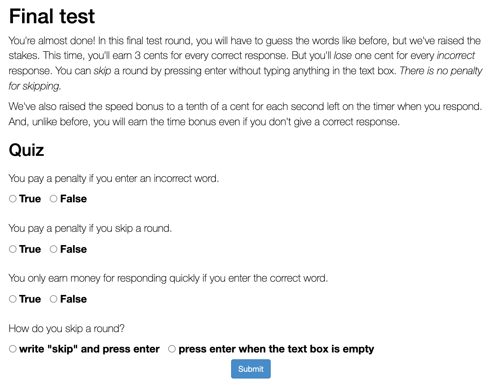
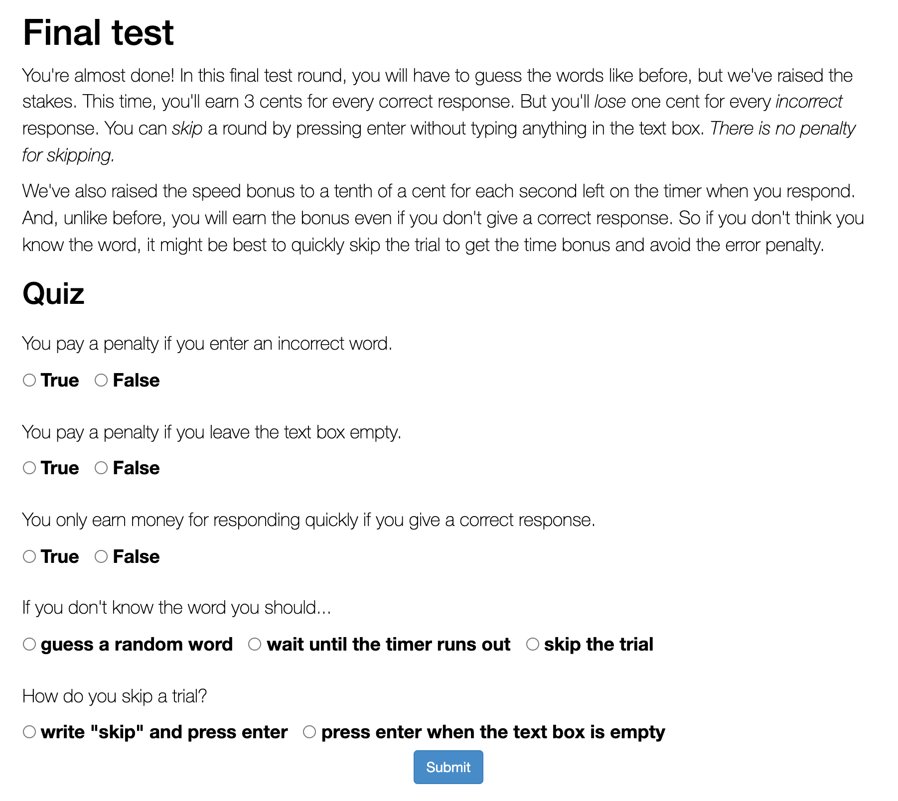

```{r setup, include=FALSE}
knitr::opts_chunk$set(
    results='asis', warning=FALSE, message=FALSE, fig.width=5, fig.height=4, fig.align="center"
)
source("setup.r")
source("stopping-setup.r")

VERSIONS = c('v6.5', 'v6.5B', 'v6.5C', 'v6.6', 'v6.7', 'v6.8')

load_data = function(type) {
    VERSIONS %>% 
    map(~ 
        read_csv(glue('../data/{.x}/{type}.csv'), col_types = cols()) %>% 
        mutate(
            version = .x,
            pilot = case_when(
                startsWith(version, "v6.5") ~ "leading instructions",
                startsWith(version, "v6.6") ~ "high bonus",
                startsWith(version, "v6.8") ~ "no time bonus",
                TRUE ~ "standard"
            ),
        )
    ) %>% 
    bind_rows
}

pretest = load_data('simple-recall') %>% 
    filter(!practice) %>% 
    group_by(wid) %>% filter(n() == 74) %>% ungroup %>%
    mutate(
        response_type = factor(response_type, 
            levels=c("correct", "intrusion", "other", "timeout", "empty"),
            # labels=c("Correct", "Intrusion", "Other")
        ),
        total_time = rt + type_time,
        correct = response_type == "correct",
    ) %>% mutate(
        base_rt = rt,
        rt = typing_rt
    )

all_trials = load_data('simple-recall-penalized') %>% 
    filter(!practice) %>% 
    mutate(
        response_type = factor(response_type, 
            levels=c("correct", "empty", "intrusion", "other", "timeout"),
            # labels=c("Correct", "Intrusion", "Other")
        ),
        total_time = rt + type_time,
        correct = response_type == "correct",
        skip = response_type == "empty",
        base_rt = rt,
        rt = typing_rt,
    )
```

# Data

Here we are comparing different pilot versions of the optimal stopping experiment.
We are trying to replicate the result from Costermans et al (1992) in which reaction 
time on omission trials (when no response is given) is increasing with feeling
of knowing (FOK) reports. We want to show this effect in our paradigm, replacing the
FOK report with the memory strength measurement based on earlier recall performance.

We've run many versions of the experiment and we get mixed results. This
report summarizes all the versions. The critical dimension appears to be the
instructions, given in full [below](#screen). To summarize, in the "leading
instructions" we encourage participants to skip trials in two ways:
1. We instruct "So if you don't think you know the word, it might be best to quickly skip the
trial to get the time bonus and avoid the error penalty." 
2. We have a quiz question "If you don't know the word you should..." with the correct
answer "guess a random word".

We've also run a pilot with a higher bonus rate (5¢ vs 3¢ per correct
response) and one with no time incentive on the critical trials. But these
changes don't seem to make as much of a difference.

<!-- Version(s): `r paste(VERSIONS)` -->

## Response types

Below are the distribution of response types in the critical trials, in aggregate
and by participant. This is before any exclusions.

```{r,fig.height=2}
all_trials %>% 
    count(pilot, response_type) %>% 
    pivot_wider(names_from=response_type, values_from=n) %>% 
    replace(is.na(.), 0) %>% 
    pivot_longer(!c(pilot, pilot), names_to="response_type", values_to="n", names_prefix="") %>%
    group_by(pilot) %>% mutate(prop = n/sum(n)) %>% ungroup() %>% 
    ggplot(aes(pilot, prop, fill=fct_rev(response_type))) +
    geom_bar(stat="identity") +
    scale_colour_manual(values=c(
        "deeppink2",
        "deeppink4", 
        "gray", 
        "springgreen4"
    ), aesthetics=c("fill", "colour"), name="") +
    labs(x="", y="Proportion of Trials") + coord_flip()
```

```{r,fig.width=7}
response_colors = scale_colour_manual(values=list(
    other="deeppink2",
    intrusion="deeppink4", 
    empty="gray", 
    correct="springgreen4"
), aesthetics=c("fill", "colour"), name="")

all_trials %>% 
    count(pilot, wid, response_type) %>% 
    pivot_wider(names_from=response_type, values_from=n) %>% 
    replace(is.na(.), 0) %>% 
    mutate(wid=fct_reorder(wid, 100*correct + empty)) %>% 
    pivot_longer(!c(pilot, wid), names_to="response_type", values_to="n", names_prefix="") %>%
    group_by(pilot, wid) %>% mutate(prop = n/sum(n)) %>% ungroup() %>% 
    ggplot(aes(wid, prop, fill=fct_rev(response_type))) +
    geom_bar(stat="identity") +
    response_colors +
    labs(x="Participant", y="Proportion of Trials") + 
    scale_x_discrete(breaks=NULL) +
    facet_wrap(~pilot, scales="free_x")
```

We see that:

- there are few errors (incorrect responses) in all pilots
- empty responses are common in all pilots
- there are more correct responses when the critical trials
  were more heavily incentivized (5¢ vs 3¢)
- theare are more empty responses with leading instructions

## Exclusions

Participants who always or never skip (give an empty response) don't provide
useful data. We thus exclude participants who don't have at least 4 skip and
non-skip trials out of the 37 critical trials. Note that we end up excluding
more participants with the leading instructions because more participants skip
almost every trial.

```{r, fig.height=2}
all_trials$name = 'Human'

excl = all_trials %>% 
    group_by(pilot,wid) %>%
    summarise(n_skip = sum(skip)) %>% 
    mutate(keep=between(n_skip, 4, 33))

excl %>%
    mutate(excluded = if_else(keep, "included", "excluded")) %>% 
    ggplot(aes(pilot, fill=excluded)) + 
    geom_bar() +
    ylab("Number of Participants") +
    scale_colour_manual(values=c(
        "gray", "dodgerblue"
    ), aesthetics=c("fill", "colour"), name="") + coord_flip() + xlab("")

keep = excl %>% filter(keep) %>% with(wid)

trials = all_trials %>% 
    filter(wid %in% keep) %>% 
    group_by(wid) %>% 
    mutate(rt_z = zscore(rt)) %>% 
    ungroup()

pretest = pretest %>% filter(wid %in% keep)

pretest %>% 
    filter(block == max(block)) %>% 
    rename(pre_correct = correct) %>% 
    mutate(pre_logrt = if_else(pre_correct, log(rt), 0)) %>% 
    group_by(wid, word) %>% 
    summarise(across(c(pre_correct, pre_logrt), mean)) %>%
    group_by(wid) %>%
    mutate(across(c(pre_correct, pre_logrt), zscore, .names="{.col}_z")) %>% 
    mutate(
        raw_strength = -((1-pre_correct) * log(15000) + pre_logrt),
        strength = zscore(raw_strength)
    ) %>% 
    right_join(trials) -> trials
```

# Subjective judgements

The most direct replication of Costermans et al.: How does reaction time depend
on explicit reports of confidence and feeling of knowing, given after a
response is made?

## Confidence for correct responses

<blockquote>
    <h4>How confident are you in your response?</h4>
    <p>Press a number between 1 and 5.</p>

    <b>1</b>&nbsp;&nbsp; I am not at all sure my response is correct<br>
    <b>2</b>&nbsp;&nbsp; I am not so sure my response is correct<br>
    <b>3</b>&nbsp;&nbsp; I am more or less sure my response is correct<br>
    <b>4</b>&nbsp;&nbsp; I am nearly sure my response is correct<br>
    <b>5</b>&nbsp;&nbsp; I am absolutely sure my response is correct<br>
</blockquote>


```{r}
trials %>% #plot
    filter(response_type == "correct") %>% 
    regress(judgement, rt) +
    xlab("Confidence Judgement")
```

All in the right direction. The effect is much larger when speed is not
incentivized. 

## FOK for empty responses

<blockquote>
    <h4>How much do you feel that you know the word?</h4>
    <p>Press a number between 1 and 5.</p>

    <b>1</b>&nbsp;&nbsp; I am absolutely sure I do not know the word<br>
    <b>2</b>&nbsp;&nbsp; I am rather sure I do not know the word<br>
    <b>3</b>&nbsp;&nbsp; I have a vague impression I know the word<br>
    <b>4</b>&nbsp;&nbsp; I am rather sure I know the word<br>
    <b>5</b>&nbsp;&nbsp; I am absolutely sure I know the word<br>
</blockquote>

```{r}
trials %>%  #plot
    filter(skip) %>% 
    regress(judgement, rt, bins=0, bin_range=1) +
    stat_summary(fun.data=mean_cl_boot, size=.2) +
    xlab("Feeling of Knowing Judgement")
```

All in the right direction! 


::: {.alert .alert-info}
**Conclusion:**  We consistently replicate the Costermans finding with explicit judgements.
Results are strongest when speed is not incentivized.
:::

# Objective memory strength measure

We can now ask the same thing, using performance on the pretest as an
objective measure of the strength of each memory. The strength of each pair is
defined as the negative average log reaction time on the two pretest
exposures, where an inaccurate response counts as the maximum reaction time.

```{r}
trials %>% #plot
    filter(response_type == "correct") %>% 
    regress(strength, rt)
```

We consistently see faster responses for higher-strength cues. This is unsurprising.

## Reaction time on empty trials

Here's the critical effect.

```{r}
trials %>% #plot
    filter(skip) %>% 
    regress(strength, rt) + 
    coord_cartesian(xlim=c(NULL), ylim=c(0, 4000))
```

The effect only comes out with leading instructions. In two pilots,
the effect was actually negaive (although given the size of the std error,
we can't take this too seriously). 

The effect is a bit more robust, when we z-score strength and reaction
time within participant (specifically for skip trials), but we still
only see it with leading instructions.

```{r}
trials %>% #plot
    filter(skip) %>% 
    group_by(wid) %>% 
    filter(sd(strength) != 0) %>% 
    mutate(strength=zscore(strength), rt_z = zscore(rt)) %>% 
    regress(strength, rt_z) +
    coord_cartesian(xlim=c(NULL), ylim=c(-1.5, 1.5))
```

This is not just some quirk of sample. I actually ran three
identical versions of the "leading instructions" experiment,
and all three of them show a strong effect, with no other
sample showing an close to the same size (with z-scoring):

```{r}
trials %>%
    filter(skip) %>% 
    group_by(wid) %>% 
    filter(sd(strength) != 0) %>% 
    mutate(strength=zscore(strength), rt_z = zscore(rt)) %>% 
    group_by(version) %>% 
    group_modify(function(data, grp) {
        lmer(rt_z ~ strength + (strength|wid), data=data) %>% tidy
    }) %>% 
    filter(term == "strength") %>% 
    select(version, estimate, std.error, p.value) %>% 
    left_join(
        load_data('participants') %>% count(version)
    ) %>% kable(digits=4)
```

# What's going on here?

Why do we only get the strength effect with the leading instructions?

## Individual regressions

Our first clue comes from looking at the effect separately for each participant:

```{r}
trials %>% 
    group_by(wid) %>% 
    filter(skip) %>% 
    ggplot(aes(strength, rt, group=wid)) + 
    geom_smooth(method="lm", level=0, size=.5, color="black") +
    facet_wrap(~pilot) +
    pretty_labs("strength", "rt")
```

In the leading instructions group, the slope varies considerably, but most
people are in the right direction. But wait---why are there so few lines in
the other groups? It turns out that many participants in those conditions have
no variance in strength on skip trials, which means we can't run a regression.
This happens when a participant only skips on images for which they answered
incorrectly in both pretest trials, resulting in the minimum possible strength
value. 

Here's a table summarizing the number and proportion of participants who skip
on at least one trial without minimum strength. (Note that it matches the number
of lines in the regression plot above).

```{r}
trials %>% 
    group_by(pilot, wid) %>% 
    filter(skip) %>% 
    summarise(x=mean(pre_correct==0))  %>% 
    group_by(pilot) %>% 
    summarise(n=sum(x != 1), prop=mean(x != 1)) %>% kable(digits=2)
```

## Metacognitive threshold

What seeems to be happening is that the skipping threshold is a bit lower
(more lenient) in the leading instructions group. We can see this in an
aggregate logistic regression:

```{r}
trials %>% 
    ggplot(aes(strength, 1*skip, color=pilot)) +
    geom_smooth(method = "glm", method.args = list(family = "binomial"), formula=y~x) +
    pretty_labs("strength", "probability of skipping")
```

It's even more clear if we show individuals' curves, using the raw (un-normalized)
strength measure. The red line is the minimum possible strength, corresponding to
two incorrect responses.

```{r}
trials %>% 
    ggplot(aes(raw_strength, 1*skip, group=wid)) +
    geom_smooth(method = "glm", method.args = list(family = "binomial"), formula=y~x, 
        se=F, color="black", size=.5) +
    facet_wrap(~pilot) +
    theme(
        panel.grid.major.x = element_line(color="gray"),
        panel.grid.major.y = element_line(color="gray"),
    ) + geom_vline(xintercept=-log(15000), color="red2") +
    pretty_labs("raw strength", "probability of skipping")
```

Where does that leave us? It seems that the effect does exist, but that it is
obscured when people only skip minimum-strength words. There are a few
strategies we could take:

1. Use the leading instructions. This is the surest thing, but it might draw
   suspicion. Personally, I think it's fine to encourage participants a bit
   here, as the effect still depends on their having the metacognitive ability.
   But I can imagine this causing problems in review.
2. Use the standard instructions, exclude participants who only skip
   minimum-strength trials and plan to collect a very large sample.
3. Try to lower peoples' skipping threshold in some other way. For example,
   we could use a stricter error penalty.
4. Use a strength measure that is more sensitive at the low end. For example,
   we could try using 2AFC.

::: {.alert .alert-info}
**Conclusion:**  We get the critical result of slower skipping for higher
strength targets, but only when we encourage skipping in the instructions.
It looks like the critical difference is that the instructions lower
the skipping threshold, giving us more range of strength in the skip 
trials.
:::


# Metacognitive accuracy

A secondary question we can ask is to what extent the metacognitive judgement
correlates with the objective memory strength measure. Overall, it looks like
it does.


```{r}
trials %>% 
    filter(skip | correct) %>% 
    group_by(wid) %>% 
    filter(sd(judgement) != 0) %>% 
    mutate(judgement=zscore(judgement), strength=zscore(strength)) %>% 
    ggplot(aes(judgement, strength, color=judgement_type)) +
    geom_point(size=.5) +
    geom_smooth(method="lm", se=F) +
    facet_wrap(~pilot) +
    labs(x="Judgement (z-scored)", "Strength (z-scored)")
```

However, when we look at just the FOK trials, we don't actually
see a consistent relationship within individuals (each thin line
is a person) and the thick line is a mixed effects fit.

```{r}
trials %>% #plot
    filter(skip) %>% 
    regress(judgement, strength, bins=0, bin_range=1) +
    # stat_summary(fun.data=mean_cl_boot, size=.2) +
    stat_summary(aes(group=wid), fun.y=mean, size=.2, geom="line") +
    xlab("Feeling of Knowing Judgement")
```

Here is the regression coefficient in a strength-by-FOK model fit separately
to each participant, excluding those who always give the same FOK rating.

```{r, fig.width=6}
fok = trials %>% 
    filter(judgement_type == "fok") %>%
    group_by(wid) %>% 
    filter(sd(judgement) != 0)

X = fok %>% 
    group_modify(function(data, grp) {
        lm(strength ~ judgement, data=data) %>% tidy(conf.int=T)
    }) %>% 
    filter(term == "judgement")  %>% 
    left_join(select(excl, wid, pilot)) %>% 
    arrange(estimate) %>% 
    ungroup() %>% 
    mutate(wid=fct_reorder(wid, estimate))

X %>% 
    ggplot(aes(estimate, wid, xmin=conf.low, xmax=conf.high, color=pilot)) +
    geom_pointrange() + geom_vline(xintercept=0) +
    theme(legend.position="top")
```

Very few participants show a positive relationship. It looks like part of the
reason for this is that participants are not using the full scale:

```{r}
trials %>% 
    filter(skip) %>% 
    ggplot(aes(judgement, ..prop..)) +
    geom_bar() +
    facet_wrap(~pilot) +
    labs(x="Feeling of Knowing Judgement", y="Proportion of Trials")

```

::: {.alert .alert-info}
**Conclusion:**  We don't see a consistent
relationship between the FOK judgement and memory strength. However, it seems
likely that this is because people aren't able to use the scale in a
meaningful way, rather than because they really don't have any sense of their
memory strength.
:::

# Miscellaneous

## Pretest accuracy

```{r,fig.height=3}
pretest %>%
    group_by(pilot, wid) %>% 
    summarise(accuracy=mean(correct)) %>% 
    ggplot(aes(pilot, accuracy)) +
    geom_quasirandom(color="gray") +
    stat_summary(fun.data=mean_cl_boot) +
    coord_flip() +
    xlab("") +
    ylim(0, 1)
```


## Critical trials reaction time

```{r,fig.height=3}
trials %>%
    mutate(response_type = case_when(
        response_type == "correct" ~ "correct",
        response_type == "empty" ~ "empty",
        TRUE ~ "error"
    )) %>% 
    ggplot(aes(pilot, rt, color=response_type)) +
    # geom_quasirandom(color="gray") +
    stat_summary(fun.data=mean_cl_boot) +
    coord_flip() +
    scale_colour_manual(values=c(
        "springgreen4",
        "gray", 
        "deeppink3"
    ), aesthetics=c("color"), name="") +
    xlab("")
```

## Instructions screenshots {#screen}





